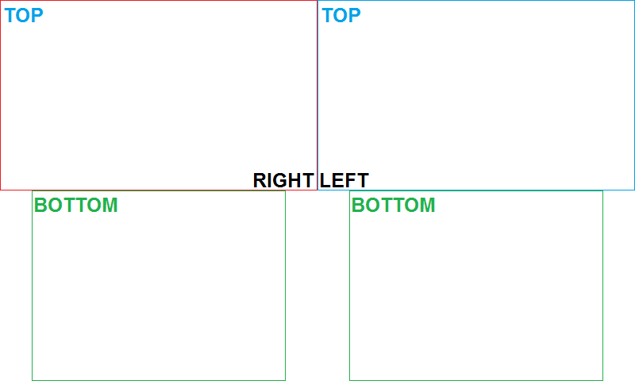

# NTRStack
Preset-based converter for NTR and HANS screenshots.    
Combines NTR and HANS screenshots in various, configurable ways using ImageMagick.    
HANS has additional options for side-by-side 3D images.

Utilizes a sort of "preset" system to config basic options to achieve results.    
Scroll down to see examples of default presets included.

Could potentially be made for Bash, given most of the work is done by ImageMagick.    
However, I'm lazy. I'll gladly accept pull requests that accomplish this.

Requirements:
----
####Windows
- Command Line
- [ImageMagick](http://imagemagick.org/script/binary-releases.php#windows)
 - `convert` must be in your path and accessible from Command Line. The installer does this by default.

####Everything else
- There's [ntr_stack.sh](https://raw.githubusercontent.com/RePod/NTRStack/master/ntr_stack.sh)

How to:
----
1. Save or create a new (below) where you want: (*Right-click*, *Save link as...*)
 - [BAT](https://raw.githubusercontent.com/RePod/NTRStack/master/ntr_stack.bat) (Windows)
 - [SH](https://raw.githubusercontent.com/RePod/NTRStack/master/ntr_stack.sh) (*nix) 
2. Place the screenshots in the same folder.
4. Run it.

**Tips**
 - The first argument can be the desired preset name, overriding the default.
 - The code can be editted to change various settings for different results.

Default presets:
----
Click images to see a more detailed view of dimensions and transparency.    
Results may differ between NTR and HANS screenshots.

**HANS** *(`top_screen=both`, `both_sbs=right`, `dupe_bot=yes`)*      

**NTR - native** *(pads similar to homemenu screenshots, padding white)*    

**NTR - default** *(stacks them normally, bottom padding transparent)*    
**HANS - default** *(single screen: `top_screen=left`)*    

**NTR - wide** *(puts them side by side)*    
**HANS - wide** *(single screen: `top_screen=left`)*    

