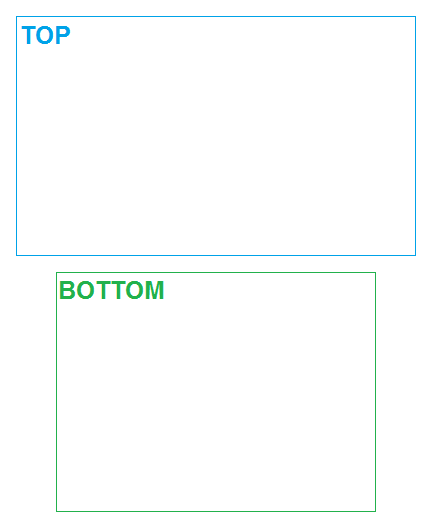
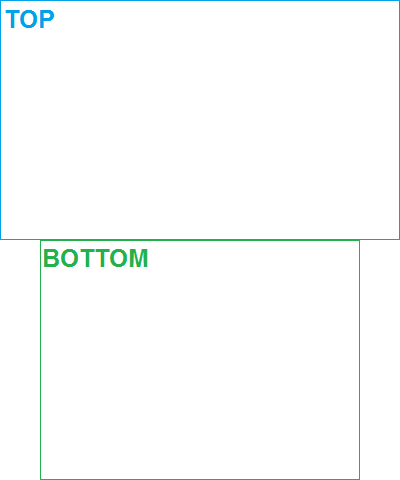

# NTRStack
Combine screenshots taken by 3DS NTR CFW using Windows Command Line and ImageMagick.

Utilizes a sort of "preset" system to config basic options to achieve results.    
Scroll down to see examples of default presets included.

This could potentially support *hax 2.5 screenshots, the only difference is the naming scheme.    
Could also potentially be made for Bash, given most of the work is done by ImageMagick.    
However, I'm lazy. I'll gladly accept pull requests that accomplish these tasks.

Requirements:
----
- Windows
 - Command Line
- [ImageMagick](http://imagemagick.org/script/binary-releases.php#windows)
 - `convert` must be in your path and accessible from Command Line. The installer does this by default.

How to:
----
1. Save or create a new [BAT file](https://raw.githubusercontent.com/RePod/NTRStack/master/ntr_stack.bat) in the desired working folder.
2. Place the screenshots in the same folder.
3. Modify the early lines containing `preset`, `orient`, `cleantemp`, and `cleansource` as needed.
 - Or not, the defaults are fine.
4. Run the BAT.
 - The first argument can be the preset name.

Default presets:
----
Click images to see a more detailed view of dimensions and transparency.

**native** *(pads similar to homemenu screenshots, padding white)*    

**default** *(stacks them normally, bottom padding transparent)*    

**wide** *(puts them side by side)*    

